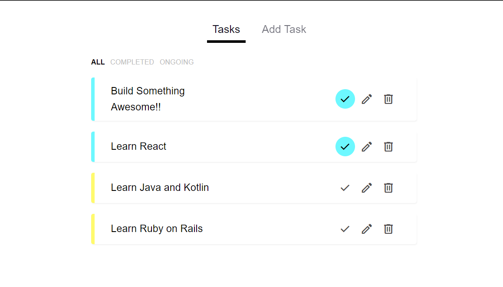

# Task Tracker with Vuejs using json-server and Pinia ( Composition api `<script setup>` )


## Project Setup and Installation
clone this repo `https://github.com/Kaung-Sintc/Task-Tracker-App-Composition-api.git` or download zip file

Install required dependencies
```
npm install
```

### start json server
```
jsx json-server data/db.json
```

### Or if you want to globally install json-server in your computer, run:

```
npm install -g json-server
```

### And start json-server by running:

```
json-server data/db.json --watch
```

## Compiles and hot-reloads for development
```
npm run dev
```

## Compiles and minifies for production
```
npm run build
```
